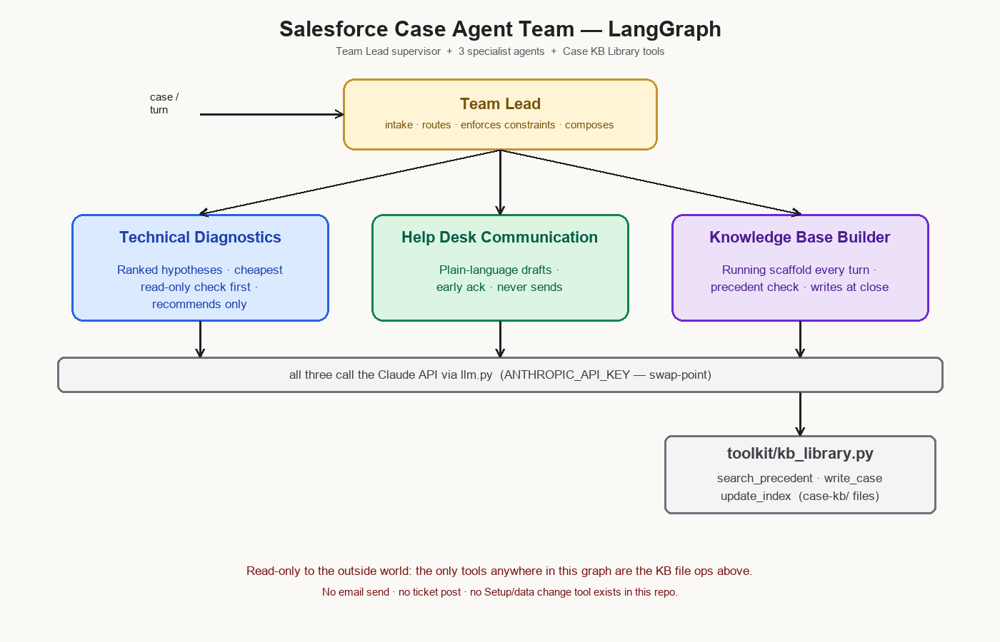

# Salesforce Case Agent Team

**Status:** 🟦 scaffold — placeholder, **not deployed or tested**. Structurally complete, authored code and docs; nothing has been installed, run, or called against a live API.

A **Team Lead + 3 specialist agents**, built in Python with **LangGraph**, that work a single Salesforce support case from intake to close — powered by the **Claude API**. It implements the author's own `biz-apps-sf-team` support-workflow skill as an actual agent graph, instead of a manually-run playbook.

## What it does

Give it a symptom ("Stage field reverts a few seconds after every save") and it works the case in three parallel lenses, coordinated by a supervisor:

- **🔧 Technical Diagnostics** — ranks hypotheses for what's actually wrong, names the cheapest read-only check to run first, and tells you whether the automation itself is broken or just working on bad data. Recommends only.
- **🎧 Help Desk Communication** — drafts the plain-language message to send the user: an early "we're on it," any info request, the eventual resolution. Drafts only.
- **📚 Knowledge Base Builder** — keeps a running case scaffold from the first turn, checks past cases for precedent before anyone starts diagnosing, and writes the closed case into a persistent library so the next similar ticket starts from experience instead of zero.

A **Team Lead** node supervises all three: it decides who has new work each turn, keeps their output in clearly separate sections, and stops to ask the human for whatever only a human can supply — a screenshot, a confirmation, a go-ahead.

## Architecture



```
                       ┌──────────────────────┐
   case / turn ───────▶│   Team Lead          │  intake · routes · enforces
                       │   (supervisor)       │  constraints · composes the
                       └──┬────────┬───────┬──┘  3-lens turn output
        ┌─────────────────┘        │       └──────────────────┐
        ▼                          ▼                          ▼
 ┌────────────────┐      ┌──────────────────┐      ┌────────────────────┐
 │ 🔧 Technical    │      │ 🎧 Help Desk     │      │ 📚 Knowledge Base  │
 │ Diagnostics    │      │ Communication    │      │ Builder            │
 └───────┬────────┘      └────────┬─────────┘      └─────────┬──────────┘
         │                        │                          ▼
         │                        │              toolkit/kb_library.py:
         │                        │              search_precedent · write_case ·
         │                        │              update_index  (case-kb/ files)
         └────────────── all three call the Claude API via llm.py ──────────────┘
```

Built as a LangGraph `StateGraph` — see [`DESIGN.md`](DESIGN.md) for the full node-by-node breakdown and the coordination rules baked into the Team Lead.

## Guardrails, by design

This team can only produce text and files for a human to review — it cannot act on its own:

- **No external actions.** There is no email tool, no ticketing tool, no Salesforce Setup/data tool anywhere in this repo. The *only* tools it has ([`toolkit/kb_library.py`](toolkit/kb_library.py)) read and write local Case KB files.
- **Drafts only.** Help Desk Communication never claims to have sent anything — every message is explicitly a draft.
- **Recommendations only.** Technical Diagnostics never proposes executing a production change itself.
- **PII discipline.** Every role is instructed to use only names and details the user or ticket actually provided — never to look up or invent personal information.
- **Authorize before advancing.** The Team Lead stops and asks the human for exactly the input needed at each genuine decision point, instead of guessing forward.

## The Case KB Library — compounding precedent

Every closed case gets written to `case-kb/`, and every new case checks that library first:

```
case-kb/
├── index.md                    — Case # | Date Closed | Symptom | Root Cause Category | File
└── cases/
    └── <case-number>-<slug>.md — full record: Issue / Root Cause / Action / Category / Status
```

Seeded here with one fake, fully-closed sample case ([`case-kb/cases/00042-flow-recursion.md`](case-kb/cases/00042-flow-recursion.md)) so the shape is visible — **no real customer data**. Real cases you run through this team will carry actual customer information; treat your working `case-kb/` copy accordingly (it's already excluded from anything you'd publish, via `.gitignore` patterns you may want to extend).

The library only grows: `write_case()` and `update_index()` in the toolkit are merge-safe and never drop or overwrite a past record.

## Claude API — the swap-point

Every role's intelligence comes from one place: [`llm.py`](llm.py), a thin wrapper around the Anthropic SDK. Swap the model, add per-role temperature, or point it at a different deployment by editing that one file — nothing else in the graph needs to change.

**This is a scaffold — not deployed, not tested, no key included.** To actually run it:

```bash
pip install -r requirements.txt
export ANTHROPIC_API_KEY=sk-ant-...   # your own key, never committed
python main.py
```

`main.py` walks a scripted example case (the field-reverts-after-save scenario) turn by turn, with comments showing the expected output shape at each step — written to be read before you run it for real.

## Project layout

```
graph.py               LangGraph StateGraph: Team Lead + 3 role nodes + KB tool usage
state.py                Pydantic AgentState (messages, case_number, symptom, hypotheses, kb_scaffold, ...)
llm.py                  Claude API client — the model/key swap-point
main.py                 Scripted example case (read, don't run — until you're ready)
prompt_library/         One system prompt per role
toolkit/kb_library.py   The only tools: file ops on case-kb/
case-kb/                Seeded library: 1 sample index row + 1 fake closed case
references/kb_template.md   Blank single-case KB structure
requirements.txt        Pinned: langgraph, langchain-core, anthropic, pydantic
```

See [`DESIGN.md`](DESIGN.md) for the full design writeup.

## Roadmap (out of scope for v1)

Live Salesforce API/MCP integration, real ticketing sync (Cases/Jira), RAG over org documentation, auto-send of drafts, multi-case batch processing.

## License

MIT — see [`LICENSE`](LICENSE).
